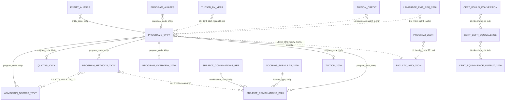
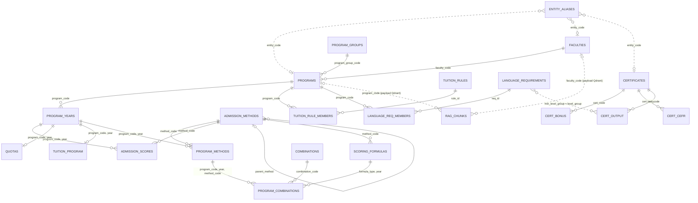

# PLAN — Kết nối các bảng dữ liệu (v1)

**Ngày:** 2026-09-26 · **Trạng thái:** đã thực hiện 2026-10-04 (xem mục "Đã thực hiện" cuối file) · Gắn với PRD v1.2 mục 10.3 (khớp thực thể), 15.1 (schema) · Đi kèm: `PLAN - Metadata Design (v2).md`

Mỗi quyết định có dòng **Vì sao**.

## Rà soát lại 2026-10-04 (sau khi xong metadata + embedding)

Đo lại toàn bộ L1–L9 trên dữ liệu hiện tại: **cả 9 vấn đề vẫn đúng y nguyên số liệu** (0 mã mồ côi; 49/68 mã nhiều tên; JSON TE1 → `FED`, TROY-IT trống mã; `XTTN` vs `XTTN_1.2/1.3`; EM4, TROY-BA chỉ 2025; 3 bảng chữ tự do 11 + 30 + 14 = 55 dòng; `Aptis Esol/ESOL/APTIS ESOL`; alias chỉ có ngành; FL1–FL4 thiếu K00). Phần mô hình đích và thứ tự vẫn dùng được. Những chỗ cần sửa/bổ sung:

| # | Chỗ | Sửa thành | Vì sao |
|---|---|---|---|
| R1 | Mục 3: "Trang ngành (151) … `faculty_code` (bổ sung)" | 152 chunk, `faculty_code` **đã có** (lấy từ `programs_2026.csv`, 2026-09-27) và đã nằm trong payload Qdrant có chỉ mục, cùng `year`, `cohort`, `is_latest`, `versioned` | Phía RAG của việc nối đã xong; Data Linking giờ chỉ còn phía SQL |
| R2 | Bước 1 "sửa TE1 → SME, TROY-IT → FAMI" | Chỉ còn sai ở `data/programs/*.json`; chunk và CSV đã đúng | Ảnh hưởng nhỏ hơn plan cũ nghĩ — không phải nhúng lại |
| R3 | `faculties` lấy từ `data/faculty/*/info.json` | Bước 1 sinh ra `data/processed/faculties.csv` và coi file này là nguồn | `data/faculty/` và `data/programs/` **không lên git** (`.gitignore` chỉ cho `data/processed/*.csv`) → clone repo về chạy `build_db.py` sẽ thiếu nguồn |
| R4 | `program_aliases` (4 dòng: TEEP → TE-EP, "CH -E20" → CH-E20…) không có trong mô hình | Giữ làm bước chuẩn hoá mã lúc nạp, không đưa vào `entity_aliases` | Đây là lỗi gõ mã trong nguồn, không phải cách người dùng gọi tên ngành |
| R5 | `program_combinations.main_subject` | Mang theo cột `main_subject_status` (161 dòng `third_party`, 1 dòng `not_found` = TROY-IT/D01) vào DB; khi trả lời môn chính thì trích dẫn bài điểm chuẩn 2026 (công thức), **không** trích dẫn tuyensinh247 | Theo quyết định đã chốt: nguồn bên thứ ba không vào danh sách nguồn, chatbot không trích dẫn |
| R6 | `scoring_formulas` khoá `formula_type` | Khoá (`formula_type`, `year`) | Hiện chỉ có 2026; năm sau thêm công thức mới sẽ trùng khoá |
| R7 | `admission_methods` "cố định 6 dòng" | Mã đang có: `THPT`, `DGTD`, `XTTN`, `XTTN_1.2`, `XTTN_1.3` (5) — thêm `XTTN_1.1` (tuyển thẳng, không có điểm chuẩn) thành 6 | Ghi rõ để không đoán |
| R8 | `programs.program_group` | Cần bảng mã: 4 giá trị dạng chữ hoa dài trong `quotas_2026` ("CHƯƠNG TRÌNH CHẤT LƯỢNG CAO - ELITECH (CỦA ĐHBK HÀ NỘI)"…) → `chuan` / `elitech` / `pfiev` / `lien_ket` | Lọc theo nhóm bằng chuỗi dài dễ sai một dấu cách |
| R9 | Bước 7 → PostgreSQL | Khi chuyển từ SQLite sang PostgreSQL: thêm service `postgres` vào `docker-compose.yml`, cổng máy **5433** | Cổng 5432 đang bị dự án khác chiếm |
| R10 | Bước 8 "Chốt trước khi sang metadata bước 3" | Bỏ — metadata và embedding đã xong | Lỗi thời |
| R11 | `cert_bonus_conversion` | 3 dòng `(HSKK, "HSKK Trung cấp (60-100)", ca_hai, 2026)` trùng khoá nhưng điểm thưởng 2/3/4 — đối chiếu lại ảnh `quydoi-cccnn-2026.png` trước khi nạp | Phát hiện khi kiểm khoá (mục 2.4); nhiều khả năng lúc đọc ảnh đã gộp mất 3 khoảng điểm. Khoá chính sẽ từ chối các dòng này |
| R12 | `admission_scores.combination_group` rỗng (204/287 dòng năm 2026) | Đổi thành `tat_ca` lúc nạp | Cột thuộc khoá chính không được NULL/rỗng |

Ca kiểm thử thật cho luồng SQL + RAG ở mục 3: **Q10** ("hệ số 2 cho môn chính") — số/công thức lấy từ `program_combinations` ⨝ `scoring_formulas` (`mon_chinh_toan` ≠ `K01`), trích dẫn từ chunk `dean2026::m3-1` + `ts::diem-chuan-2026-3` (xem `PLAN - Embedding (v1).md`).

3 quyết định ở mục 6 vẫn chờ anh chốt.

## Vì sao cần kế hoạch riêng cho việc nối bảng

Câu hỏi thật của học sinh hay đi qua **nhiều bảng cùng lúc**:

- "IT1 xét tổ hợp nào, tính điểm thế nào, điểm chuẩn 3 năm gần đây?" → tổ hợp + công thức + điểm chuẩn
- "Các ngành của Trường Kinh tế năm 2026 lấy bao nhiêu điểm, học phí bao nhiêu?" → Trường/Khoa + ngành + điểm + học phí
- "Em có IELTS 6.5 thì được quy đổi mấy điểm, có đủ chuẩn đầu ra ngành IT-EP không?" → chứng chỉ + quy đổi + chuẩn đầu ra theo nhóm ngành

Mỗi bảng đúng riêng lẻ vẫn chưa đủ: nếu **khoá nối** giữa chúng lệch (tên ngành viết 2 kiểu, mã Khoa sai, tên chứng chỉ khác nhau) thì phép nối âm thầm trả thiếu dòng — loại lỗi khó thấy nhất vì câu trả lời vẫn "trông đúng".

---

## 1. Hiện trạng đo được (2026-09-26)

### Đã tốt

| Kiểm tra | Kết quả |
|---|---|
| `program_code` ở 10 bảng số liệu → danh mục ngành cùng năm | **0 mã mồ côi** |
| 68 file `data/programs/*.json` ↔ danh mục ngành 2026 | khớp 68/68 |
| Mã tổ hợp trong bảng tổ hợp và bảng điểm chuẩn → bảng giải nghĩa tổ hợp | 0 mồ côi |
| `formula_type` → bảng công thức | 0 mồ côi |
| `entity_aliases` → mã ngành | 0 mồ côi |

**Vì sao được như vậy:** từ đầu mọi bảng đều dùng `program_code` làm khoá và mã đã được chuẩn hoá (TEEP → TE-EP, "CH -E20" → CH-E20 qua `program_aliases`). Phần này giữ nguyên.

### Chỗ sẽ gây lỗi khi nối

| # | Vấn đề | Số liệu | Hậu quả nếu để nguyên |
|---|---|---|---|
| L1 | **Không có bảng Trường/Khoa làm chuẩn.** CSV ngành chỉ có `faculty_name` (vd "Trường CNTT&TT"), `info.json` của Khoa ghi tên khác ("Trường CNTT và TT"); JSON ngành gán **TE1 → FED** (sai, TE1 thuộc Trường Cơ khí) và **TROY-IT không có mã** | 10 Khoa, 2 ngành sai/thiếu | Hỏi "ngành của Trường Cơ khí" thiếu TE1; chunk trang ngành không gắn được `faculty_code` |
| L2 | **Một mã ngành, nhiều tên** giữa các bảng | 49/68 mã có ≥ 2 tên (vd IT-E7: "Công nghệ thông tin (Global ICT)" / "Công nghệ Thông tin Global ICT") | Bot hiển thị tên khác nhau trong cùng một câu trả lời; ai nối bằng tên thay vì mã sẽ trượt |
| L3 | **Phương thức khác độ chi tiết:** bảng phương thức ghi `XTTN`, bảng điểm chuẩn ghi `XTTN_1.2` / `XTTN_1.3` | 3 bảng | "IT1 có xét XTTN không?" nối sang điểm chuẩn bằng `=` sẽ ra rỗng |
| L4 | **Danh mục ngành đổi theo năm:** EM4, TROY-BA chỉ có 2025; 5 ngành mới 2026; FL3 mới từ 2025 | 64 / 65 / 68 ngành | Hỏi "TROY-BA 2026" phải trả lời "năm 2026 không tuyển", không phải "không có dữ liệu" |
| L5 | **Bảng khoá bằng chữ tự do, không bằng mã:** `tuition_by_year.program_codes` ("36 ngành (Cơ điện tử, …)"), `tuition_credit.programs_listed`, `language_exit_requirement.program_group` ("CTĐT chuẩn (trừ nhóm ngành ngôn ngữ)") | 3 bảng, 55 dòng | Không trả lời được "học phí tín chỉ ngành IT1" hay "chuẩn đầu ra ngành IT-EP" bằng truy vấn — phải để LLM đọc chữ rồi đoán |
| L6 | **Tên chứng chỉ không thống nhất** giữa 3 bảng chứng chỉ: `Aptis Esol` / `Aptis ESOL` / `APTIS ESOL` | 3 bảng | Nối "chứng chỉ → quy đổi → chuẩn đầu ra" trượt ở chỗ khác hoa/thường |
| L7 | **Từ điển alias chỉ có ngành** (168 dòng) và nhóm ngành (6); **không có Trường/Khoa, chứng chỉ** | — | "Trường CNTT", "SoICT", "viện điện" không nhận ra được |
| L8 | FL1–FL4 xét ĐGTD (có trong bảng phương thức và điểm chuẩn TSA) nhưng **thiếu dòng tổ hợp K00** | 4 ngành | Hỏi "FL1 xét ĐGTD không" theo bảng tổ hợp ra "không" — sai |
| L9 | Tổ hợp theo ngành **chỉ có năm 2026**; 2024–2025 không có | — | Đã biết từ trước (v1); câu hỏi tổ hợp năm cũ phải fallback theo PRD 13.2 |

### Sơ đồ hiện trạng (bổ sung 2026-10-04)

File tách theo năm gộp thành một khối `_YYYY`. Nét liền là cột nối đang khớp, nét đứt là chỗ đang lỗi. Bản có đủ cột ở tab "Hiện trạng CSV" của trang sơ đồ (link ở mục 2.4). So với sơ đồ đích ở mục 2.4 thì thấy Data Linking sửa đúng các nét đứt này.



`admission_fees` không nối với bảng nào. L2 (49 mã nhiều tên) không phải một quan hệ: `program_name` bị chép lặp ở 10 file nên không vẽ được thành nét.

---

## 2. Mô hình đích

Chia hai loại bảng: **bảng danh mục** (mỗi thực thể một dòng, là nơi duy nhất giữ tên/thuộc tính) và **bảng số liệu** (chỉ giữ mã + số, nối về danh mục).

**Vì sao tách như vậy:** L1, L2, L6 đều cùng một gốc — cùng một thứ (ngành, Khoa, chứng chỉ) được ghi tên ở nhiều nơi. Chỉ cho tên sống ở **một** bảng thì lệch tên không thể xảy ra nữa, và sửa tên chỉ sửa một chỗ.

### 2.1 Bảng danh mục

| Bảng | Khoá chính | Cột chính | Lấy từ |
|---|---|---|---|
| `faculties` (mới) | `faculty_code` | tên chuẩn, tên ngắn, website, link giới thiệu | 10 file `data/faculty/*/info.json` |
| `programs` (gộp 3 file `programs_<năm>`) | `program_code` | tên chuẩn, `faculty_code`, `program_group` (chuẩn / Elitech / PFIEV / liên kết), ngôn ngữ, bằng | `programs_2026` + `program_overview_2026` + quotas (`program_group`) |
| `program_years` (mới) | (`program_code`, `year`) | ngành có tuyển năm đó không | `programs_2024/25/26` |
| `admission_methods` (mới) | `method_code` | tên hiển thị, `parent_method` (`XTTN_1.2` → `XTTN`), thang điểm | cố định 6 dòng |
| `combinations` | `combination_code` | các môn | `subject_combinations_ref` (đã có) |
| `scoring_formulas` | `formula_type` | công thức, thang | đã có (`scoring_formulas_2026`) |
| `certificates` (mới) | `cert_code` (vd `IELTS_ACADEMIC`) | tên hiển thị | gom từ 3 bảng chứng chỉ |

**Vì sao `programs` là một bảng cho mọi năm, kèm `program_years`:** mã ngành ổn định qua năm (IT1 năm 2024 và 2026 là một ngành); để 3 file danh mục riêng thì mỗi lần hỏi liên năm phải gộp tay. `program_years` giải quyết L4: phân biệt được "không tuyển năm đó" với "không có dữ liệu".
**Vì sao tên chuẩn lấy từ `programs_2026`:** đây là tên trong đề án 2026 — văn bản chính thức mới nhất. Các tên khác (trên ảnh điểm chuẩn, trang ngành) giữ lại trong `entity_aliases` để vẫn nhận ra khi người dùng gõ.
**Vì sao `admission_methods` có `parent_method`:** giữ được cả hai độ chi tiết (L3) — "có xét XTTN không" hỏi ở cấp cha, "điểm chuẩn XTTN 1.3" hỏi ở cấp con, không phải chọn bỏ một bên.
**Vì sao cần `certificates`:** 3 bảng chứng chỉ phục vụ 3 mục đích khác nhau (quy đổi điểm tuyển sinh / tương đương CEFR / chuẩn đầu ra) — PRD 15.1 đã cảnh báo không được trộn. Giữ 3 bảng riêng, chỉ dùng chung **mã** chứng chỉ để nối (L6).

### 2.2 Bảng số liệu (chỉ giữ mã)

| Bảng | Khoá | Nối về |
|---|---|---|
| `admission_scores` (gộp 3 năm) | `program_code`, `year`, `method_code`, `combination_group` | programs, admission_methods |
| `quotas` | `program_code`, `year` | programs |
| `program_methods` | `program_code`, `year`, `method_code` | programs, admission_methods |
| `program_combinations` | `program_code`, `year`, `method_code`, `combination_code` (+ `main_subject`, `formula_type`) | programs, combinations, scoring_formulas |
| `tuition_program` | `program_code`, `year` | programs |
| `tuition_rules` | `rule_id`, `year` | qua bảng cầu `tuition_rule_members` |
| `cert_bonus_conversion` / `cert_cefr_equivalence` / `cert_equivalence_output` | `cert_code`, `cert_value`, `year` | certificates |
| `language_exit_requirement` | `req_id`, `year`, `cohort` | qua bảng cầu `language_req_members` |
| `admission_fees` | `fee_type`, `year` | — |

**Vì sao gộp 3 năm điểm chuẩn thành một bảng có cột `year`:** câu hỏi xu hướng ("điểm IT1 3 năm") là một truy vấn thay vì ba; schema đã giống nhau hoàn toàn.
**Vì sao bỏ `program_name` khỏi bảng số liệu:** đây chính là chỗ sinh ra 49 mã nhiều tên (L2). Giữ bản gốc ở `data/processed/` để đối chiếu nguồn; bảng nạp vào DB chỉ có mã.

### 2.3 Bảng cầu cho các quy định theo nhóm ngành (L5)

Học phí tín chỉ 2024–2025 và chuẩn đầu ra ngoại ngữ **không quy định theo từng ngành mà theo nhóm** ("CTĐT chuẩn trừ nhóm ngôn ngữ", "nhóm 550 nghìn/tín chỉ"). Thêm bảng cầu `(rule_id, program_code)` liệt kê tường minh ngành nào thuộc nhóm nào.

**Vì sao làm bảng cầu thay vì để LLM đọc chữ:** nguyên tắc PRD — số liệu trả lời phải đến từ truy vấn, LLM không tự suy. "IT-EP có thuộc 'Chương trình tiên tiến ELITECH tăng cường ngoại ngữ' không?" là suy luận mà mô hình dễ sai, trong khi con người gán một lần là xong.
**Vì sao làm tay, không script:** các nhóm được mô tả bằng chữ tự do ("và các CTĐT chuẩn khác", "trừ nhóm ngành ngôn ngữ"). Script so tên sẽ gán sai ở đúng những chỗ mơ hồ nhất. 55 dòng nhóm → ước chừng 68 ngành × 2 bảng, làm tay kèm cột `note` ghi căn cứ.
**Rủi ro phải ghi rõ:** bảng cầu là **diễn giải của mình** từ văn bản, nên `verification_status = rule_derived` và citation vẫn trỏ về văn bản gốc.

### 2.4 Khoá chính và sơ đồ ER (bổ sung 2026-10-04)

Sơ đồ có thể bấm xem theo từng cụm: https://claude.ai/artifact/GVonC7WEHGSsyN8nToHprG (trang riêng tư, cần chia sẻ nếu người khác cần xem).

CSV hiện chưa có cột `id`, và **không cần thêm cho mọi bảng**. Khoá chính là tập cột đủ phân biệt mọi dòng. Đã kiểm trên dữ liệu thật: mọi bảng đều có tập cột như vậy và không trùng, trừ R11.

| Loại bảng | Khoá chính | Ví dụ |
|---|---|---|
| Danh mục | Mã có sẵn | `programs.program_code`, `combinations.combination_code`, `faculties.faculty_code` |
| Số liệu | Khoá ghép từ các mã (cũng là khoá ngoại) | `admission_scores (program_code, year, method_code, combination_group)` |
| Quy định theo nhóm | Id đọc được, ghi sẵn trong CSV | `tuition_rules.rule_id = "hp2425-chuan-550"`, `language_requirements.req_id = "nn2026-chuan"` |

**Vì sao không dùng id tự tăng:** DB được dựng lại từ CSV mỗi lần chạy `build_db.py`. Nếu thứ tự dòng đổi thì id tự tăng cũng đổi, nên không bảng nào tham chiếu được lâu dài. Mã tự nhiên không đổi, đọc là hiểu, và trùng với mã trong payload Qdrant.
**Vì sao bảng quy định cần id ghi sẵn trong CSV:** bảng cầu (`tuition_rule_members`, `language_req_members`) được gán tay và trỏ tới id đó. Nếu id sinh ra lúc nạp thì bảng cầu trỏ sai sau mỗi lần dựng lại.
**Cột mới so với mục 2.2:** `language_requirements.min_level_group` (gán tay, vd "Bậc 3") để nối sang `cert_output.level_group`, nhờ đó trả lời được "IELTS 6.5 có đủ chuẩn đầu ra không" bằng truy vấn.



Nét liền là khoá ngoại thật trong DB. Nét đứt là liên kết logic, do `validate_links.py` kiểm tra. **Vì sao:** `entity_aliases.entity_code` trỏ tới nhiều loại bảng tuỳ `entity_type`, mà một khoá ngoại chỉ trỏ được tới một bảng. Chunk RAG thì nằm ở Qdrant, không cùng cơ sở dữ liệu. `program_combinations` trỏ tới `program_methods` (không trỏ thẳng tới `program_years`) để DB tự chặn trường hợp có tổ hợp mà không có phương thức. Đây là chiều ngược của lỗi L8.

---

## 3. Nối RAG với bảng

RAG và SQL không nối bằng JOIN mà bằng **metadata dùng chung mã**:

| Chunk | Mang mã | Dùng để |
|---|---|---|
| Trang ngành (151) | `program_code` + `faculty_code` (bổ sung) | Hỏi ngành X → lọc chunk đúng ngành trước khi tìm |
| Giới thiệu Khoa (38) | `faculty_code` | Hỏi Trường Y → lọc chunk đúng Khoa |
| Đề án, bài tuyển sinh | `year` | Lọc đúng năm |
| Quy định ngoại ngữ | `year` + `cohort` | Phân biệt K71 / K70 |

**Quy tắc trả lời:** câu hỏi có số (điểm, học phí, chỉ tiêu, quy đổi) → **số từ SQL**, RAG chỉ để giải thích và trích dẫn văn bản. **Vì sao:** v1 (mục C) đã phát hiện số điểm chuẩn xuất hiện cả trong văn kể RAG; lấy số từ RAG là đi đường tránh AC1 và không có gì bảo đảm văn kể đủ.

Luồng một câu hỏi, ví dụ "IT1 tính điểm thế nào, năm ngoái bao nhiêu điểm?":

1. `entity_aliases`: "IT1" → `program_code = IT1`
2. SQL: `program_combinations` ⨝ `combinations` ⨝ `scoring_formulas` → tổ hợp + môn chính + công thức
3. SQL: `admission_scores` where `year = 2025` → điểm theo phương thức / nhóm tổ hợp
4. RAG: lọc `document_type = tin_tuyen_sinh`, `year = 2025` → đoạn "Hướng dẫn cách xác định Điểm Xét" để trích dẫn
5. Trả lời: số từ bước 2–3, citation từ bước 4 + `source_url` của dòng SQL

---

## 4. Kiểm tra: `scripts/validate_links.py` (mới)

| Luật | Mức | Bắt được |
|---|---|---|
| Mọi khoá ngoại tồn tại ở bảng danh mục | Lỗi | mã mồ côi |
| Mọi ngành có đúng 1 `faculty_code` hợp lệ | Lỗi | L1 (TE1, TROY-IT) |
| `program_name` chỉ xuất hiện ở bảng `programs` | Lỗi | L2 tái phát |
| Mỗi (ngành, năm) trong `program_years` có đủ: chỉ tiêu, phương thức, điểm chuẩn | Cảnh báo | dữ liệu thủng theo năm |
| Ngành có phương thức X thì có tổ hợp của phương thức X | Cảnh báo | L8 (FL + ĐGTD) |
| `method_code` con có `parent_method` tồn tại | Lỗi | L3 |
| Chứng chỉ trong 3 bảng đều có `cert_code` | Lỗi | L6 |
| Mọi ngành, Khoa đều có ít nhất 1 alias | Cảnh báo | L7 |
| Mọi ngành trong năm có mặt trong bảng cầu học phí / chuẩn đầu ra | Cảnh báo | L5 thiếu gán |

Như `validate_aliases.py`: **thử ngược bằng lỗi cố ý** (đổi mã Khoa của 1 ngành, xoá 1 alias…) để chắc validator bắt được.

---

## 5. Thứ tự thực hiện

| Bước | Việc | Ước lượng | Vì sao ở vị trí này |
|---|---|---|---|
| 1 | Tạo `faculties`; gán `faculty_code` cho 68 ngành từ `faculty_name` của danh mục; **sửa TE1 → SME, TROY-IT → FAMI** | ~0,5h | Mọi thứ phía sau (chunk ngành, alias Khoa) cần mã Khoa đúng |
| 2 | Tạo `programs` + `program_years`; chọn tên chuẩn; đưa các tên khác vào `entity_aliases` | ~1h | Gỡ L2 trước khi bỏ `program_name` khỏi bảng số liệu |
| 3 | `admission_methods` + `certificates`; thêm cột mã vào 3 bảng chứng chỉ | ~1h | Việc cơ học, rủi ro thấp |
| 4 | Thêm dòng K00 cho FL1–FL4 (căn cứ: bảng phương thức + điểm chuẩn TSA) | ~10 phút | Sửa dữ liệu, ghi `verification_status = rule_derived` |
| 5 | Alias Trường/Khoa (~40 dòng: tên đầy đủ, tên cũ "Viện…", viết tắt SoICT, SEEE…) | ~1h | Cần có trước khi test câu hỏi theo Khoa |
| 6 | Bảng cầu học phí tín chỉ + chuẩn đầu ra ngoại ngữ (làm tay) | ~2h | Phần tốn công nhất, làm khi khung đã ổn |
| 7 | `scripts/build_db.py`: nạp toàn bộ vào SQLite (kiểm thử) theo schema mục 2 | ~1,5h | Chạy thật mọi phép nối trước khi lên PostgreSQL |
| 8 | `validate_links.py` + thử ngược | ~1,5h | Chốt trước khi sang metadata bước 3 |

**Vì sao nạp SQLite trước dù PRD chọn PostgreSQL:** SQLite không cần dựng server, chạy được trong script kiểm tra và bộ test; cú pháp JOIN hai bên như nhau. Khi schema ổn thì chuyển sang PostgreSQL chỉ là đổi chuỗi kết nối.
**Vì sao `data/processed/*.csv` vẫn là bản gốc:** các script bóc dữ liệu đang ghi vào đó; DB là sản phẩm **sinh ra** từ CSV (`build_db.py` chạy lại được), nên sửa dữ liệu chỉ ở một chỗ.

---

## 6. Cần anh quyết

1. **Tên chuẩn của ngành** lấy theo đề án 2026 (khuyến nghị) hay theo trang giới thiệu ngành?
Giữ tên ngành theo đúng chuẩn đề án 2026, các ngành chỉ thống nhất một mã ngành ngành nào thiếu không biết chọn cái nào hãy hỏi lại tôi 
2. **EM4, TROY-BA** (chỉ tuyển 2025): giữ trong `programs` như ngành đã dừng tuyển (khuyến nghị — để trả lời đúng "năm nay không tuyển") hay bỏ?
Không bỏ giữ trong programe
3. **Bảng cầu học phí tín chỉ 2024–2025** có làm không? Học phí 2026 theo ngành đã có ở `tuition_2026`; bảng tín chỉ chỉ cần nếu anh muốn trả lời "bao nhiêu tiền một tín chỉ" (số năm 2024–2025, phải kèm ghi chú năm).
có làm bảng cầu học phí tín chỉ bảng này sẽ dùng chung cho các năm để trả lời câu hỏi

---

# Đã thực hiện (2026-10-04)

## Quyết định đã chốt

| # | Quyết định | Cách làm |
|---|---|---|
| 1 | Tên chuẩn theo đề án 2026; mỗi ngành một mã | `programs.program_name` lấy từ `programs_2026`. EM4 và TROY-BA không có trong đề án 2026 nên lấy theo danh mục 2025 (EM4 chỉ có một tên; TROY-BA có 2 cách viết, cách còn lại đã vào alias). Bỏ hậu tố "(mới)" ở 5 ngành (người dùng chốt), vì "(mới)" chỉ đúng cho năm 2026 — năm mở ngành đã có trong `program_years` |
| 2 | Giữ EM4, TROY-BA | `program_years` chỉ có 2024, 2025 → trả lời được "năm 2026 không tuyển" và vẫn tra được điểm chuẩn cũ |
| 3 | Làm bảng cầu học phí tín chỉ, **dùng chung cho các năm** | Gán cả 5 ngành mở 2026 theo câu "và các CTĐT chuẩn khác" (ED5, FL4 → nhóm 480) và "các chương trình tiên tiến khác" (CH-E20, EM-E17, MI-E22). **Luật trả lời (cho SQL Tool Tuần 3):** số học phí tín chỉ luôn kèm "năm học 2024–2025", vì đó là năm của văn bản |
| 4 | Lệ phí thi TSA: giữ dòng như người dùng đã sửa (500.000đ, `year = 2024`, nguồn đề án 2024) | Không đổi. **Lưu ý:** đề án 2024 ghi 450.000đ; mức 500.000đ là của 2026 và chưa có link nguồn — khi có link nên tách thành dòng `year = 2026` riêng |

## Kết quả

| Hạng mục | Kết quả |
|---|---|
| DB | `data/db/hust.sqlite` (không lên git — sinh lại từ CSV bằng `build_db.py`): 22 bảng, **0 trùng khoá, 0 khoá ngoại mồ côi** |
| Số dòng khớp nguồn | `programs` 70 (68 + EM4 + TROY-BA) · `program_years` 197 (64 + 65 + 68) · `admission_scores` 687 (128 + 272 + 287) · `program_combinations` 297 (293 + 4 dòng K00) · `quotas` 133 · `tuition_rules` 41 (11 + 30) |
| Bảng nối do người gán (`data/processed/linking/`, lên git) | `faculties` (10) · `program_groups` (4) · `admission_methods` (6) · `certificates` (27) · `tuition_rule_members` (161) · `language_req_members` (72) · `program_combinations_extra` (4) |
| Alias | 174 → 253 dòng: +32 biến thể tên ngành, +29 Trường/Khoa (10 viết tắt, 15 tên cũ "Viện…", 4 tên đầy đủ), +18 chứng chỉ. `validate_aliases.py`: 0 lỗi, 0 cảnh báo (kể cả giả lập tra cứu) |
| `validate_links.py` | **0 lỗi**, 5 cảnh báo đều là khoảng trống của nguồn (2024 không có bảng chỉ tiêu và phương thức; bảng học phí theo năm 2024–2025 không có dòng PFIEV và không có FL3). Tự thử ngược **12/12** |
| Validator cũ | `validate_metadata` 0 lỗi (tự thử 19/19); chunk RAG sau khi đổi nguồn mã Khoa **giống từng byte** → không phải nhúng lại |

Truy vấn mẫu chạy đúng trên DB: Q10 (công thức theo tổ hợp: K01 67 ngành, môn chính Toán 61, không môn chính 14, chưa rõ 1); "IELTS 6.5 đủ chuẩn đầu ra không" (Bậc 4 → đạt IT1 và IT-E10, chưa đạt FL1, IT-EP xét tiếng Pháp); "TROY-BA 2026" (chỉ có 2024, 2025); "các ngành của Viện Cơ khí động lực" (tên cũ → SME, 12 ngành gồm TE1); điểm chuẩn XTTN của IT1 theo cấp con 1.2 và 1.3.

## Các lựa chọn phát sinh lúc làm — và vì sao

| Lựa chọn | Vì sao |
|---|---|
| Bảng nối đặt ở `data/processed/linking/`, không sửa vào CSV do script sinh | `subject_combinations_2026.csv` và 3 bảng chứng chỉ do script ghi đè khi chạy lại (`verify_subject_combinations.py --write`, `build_cert_tables.py`). Sửa thẳng vào đó thì lần chạy lại sẽ mất phần sửa. Dòng K00 của FL1–FL4 và mã chứng chỉ vì vậy đi qua file riêng |
| Cột id thêm thẳng vào `tuition_by_year`, `tuition_credit`, `language_exit_requirement_2026` | Ba bảng này không có script nào ghi đè (lập tay từ văn bản), và id là danh tính của dòng nên phải đi cùng dòng. `normalize_csv_meta.py` giữ cột lạ — đã kiểm chạy lại không đổi byte nào |
| **R11 không phải lỗi đọc ảnh:** cột trong đề án là "HSK+HSKK" — một mức cần đồng thời HSK và HSKK | Xem lại ảnh `quydoi_cccnn_2026.png`: ở mức 2–4, HSKK đều là "Trung cấp (60-100)", chỉ phần HSK đi kèm khác nhau. Tách thành 2 chứng chỉ thì sinh ra 3 dòng trùng khoá. Đã gộp thành một chứng chỉ `HSK_HSKK` ("HSK4 (180-210) + HSKK Trung cấp (60-100)"), sửa cả CSV lẫn `build_cert_tables.py` |
| `faculties.csv` là nguồn duy nhất của mã Khoa; `normalize_chunks.py`, `crawl_programs.py`, `crawl_program_pages.py` đọc từ đó | Trước đây mã Khoa nằm chép tay ở 2 nơi. **Gốc lỗi L1:** `crawl_programs.py` gán mã theo trang Khoa nào có link tới ngành (trang FED có link trùng tên → TE1 bị gán FED), thay vì theo `faculty_name` của danh mục. Đã sửa cách gán và 2 file JSON |
| Tên Khoa chuẩn = chuỗi trong danh mục ngành đề án 2026 ("Trường CNTT&TT") | Cùng nguyên tắc với tên ngành (quyết định 1). Tên đầy đủ và tên trong `info.json` đưa vào alias |
| Tên cũ "Viện…" chỉ thêm khi **có trong dữ liệu đã thu thập** (giới thiệu Trường/Khoa, Sổ tay) | Tránh bịa alias. FAMI, SOFL không tìm thấy tên cũ nào → chưa có |
| Chứng chỉ có thêm cột số `value_min`, `value_max` (tính lúc nạp) | `cert_value` là chữ ("5.5÷6.5", "5,5 - 6,5") nên SQL không so sánh được với "IELTS 6.5". Giá trị không phải số ("Level 3") để trống; cột chữ gốc giữ nguyên |
| `admission_scores.combination_group` rỗng → `tat_ca` (R12) | Cột thuộc khoá chính không được rỗng |
| Khoá ngoại `program_combinations → program_methods` (không trỏ thẳng `program_years`) | DB tự chặn trường hợp có tổ hợp mà ngành không xét phương thức đó |
| Luật E6 (điểm chuẩn phương thức con phải có phương thức cha) chỉ xét năm có bảng phương thức | Năm 2024 không có bảng phương thức; báo 128 dòng lỗi là che mất lỗi thật. Khoảng trống này báo một lần ở W1 |
| `ET-E9` xếp vào nhóm chuẩn đầu ra tiếng Anh (Elitech) kèm ghi chú | Tên ngành ở bảng chỉ tiêu có "tăng cường tiếng Nhật", nhưng Phụ lục VII chỉ nêu IT-E6, ME-NUT — cần đối chiếu bản in |
| 2 dòng gán học phí/ngoại ngữ dựa trên suy luận được đánh dấu "suy luận" trong `note` | FL3 → nhóm 480 ("và các CTĐT chuẩn khác"); "Ngôn ngữ Anh" → FL1; "các CT tiên tiến khác" = Elitech trừ các nhóm có dòng riêng. Mọi dòng bảng cầu đều `verification_status = rule_derived` |

## Thứ tự chạy lại

```
(script bóc nguồn nào đổi thì chạy script đó)
python scripts/normalize_csv_meta.py
python scripts/validate_aliases.py          # 0 lỗi
python scripts/build_db.py                  # -> data/db/hust.sqlite, 0 trùng khoá, 0 mồ côi
python scripts/validate_links.py            # 0 lỗi
```

## Còn lại (ngoài phạm vi lần này)

- Chuyển SQLite → PostgreSQL (service `postgres` trong `docker-compose.yml`, cổng máy 5433) khi bắt đầu Admission SQL Tool (Tuần 3).
- `cert_value` dạng nhiều khoảng ("6.0-6.5 / 7.0-7.5 / 8.0" của VSTEP 2025) chưa tách được thành số.
- Bảng tổ hợp theo ngành vẫn chỉ có 2026 (L9).

